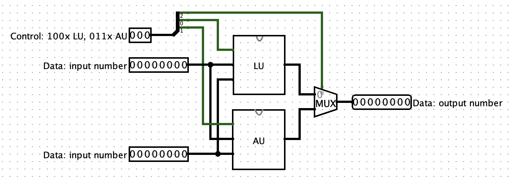
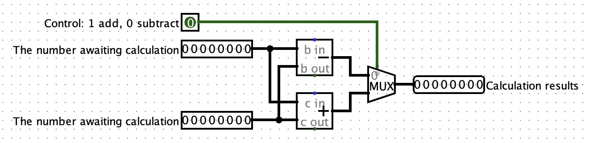
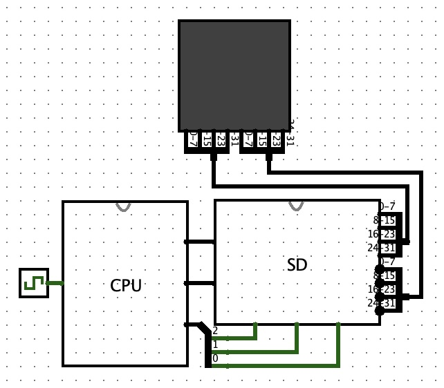
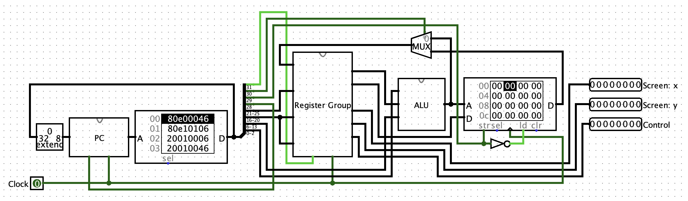
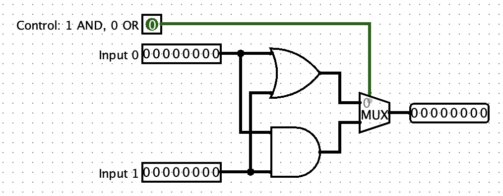
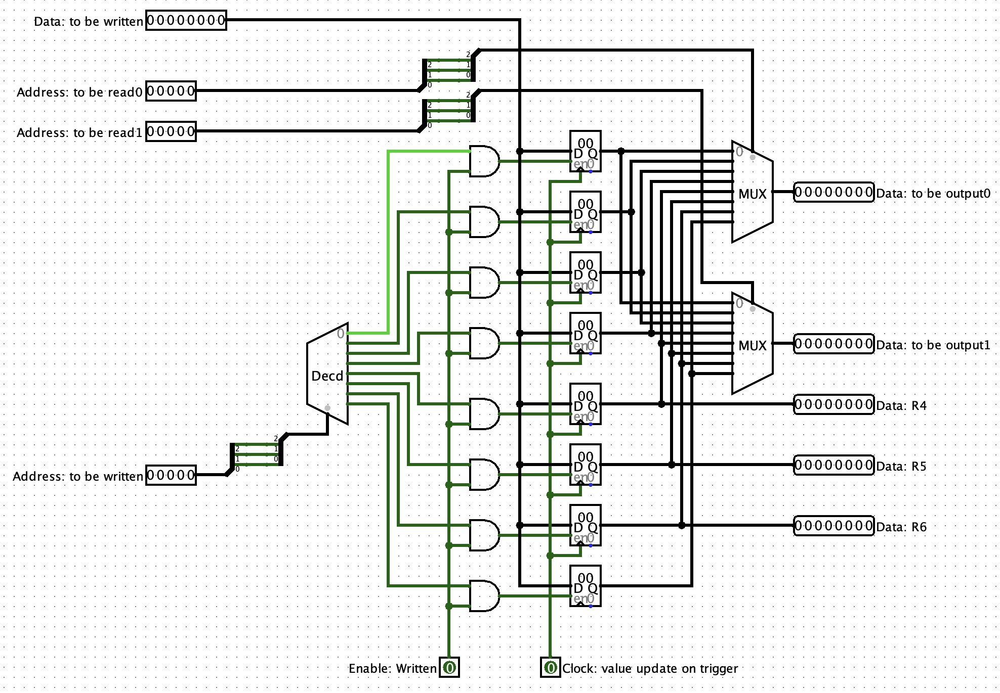
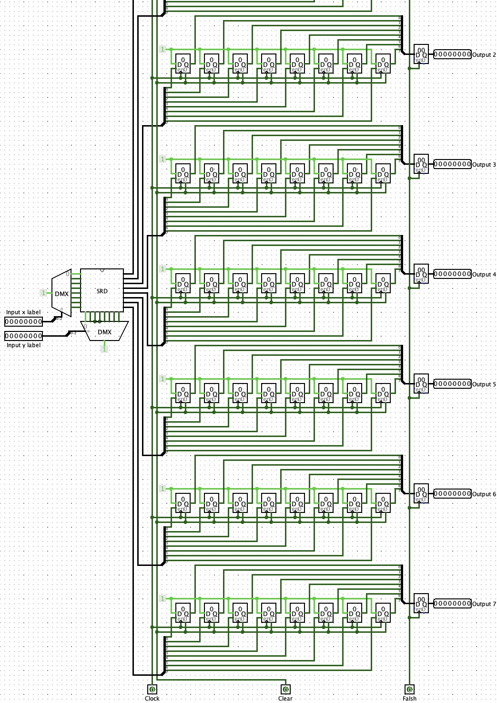
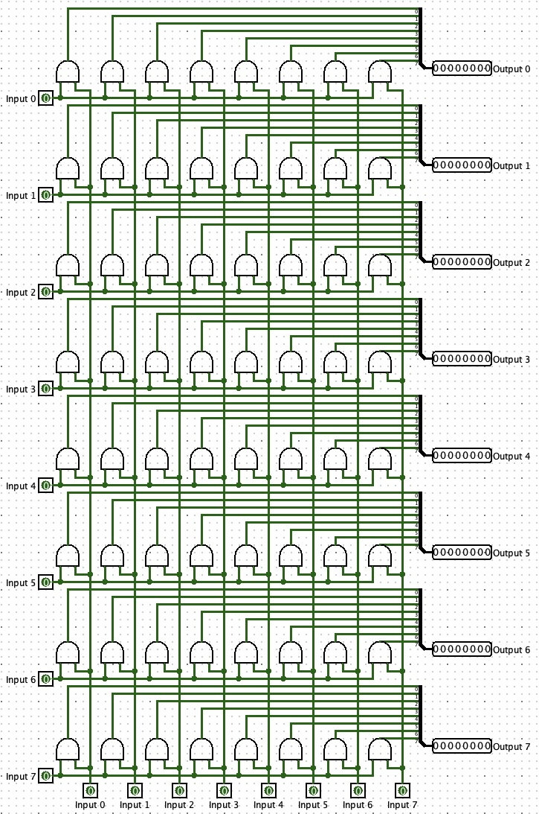

[首次运行需要执行以下命令]
chmod +x build.sh clear.sh compile.sh
mkdir res
./build.sh

[每次编译都需要执行以下步骤]
1. 把需要编译的文件放在 res 目录下 （在 res 目录添加新文件后需要重新 build ）
2. 终端执行 ./compile.sh
3. 打开 logisim-generic-2.7.1.jar 软件（需要用 java Launch 启动）（可以在 http://www.cburch.com/logisim/download.html 自行下载）
4. 点击 File -> Open 打开 Snap_game.circ 文件
5. 在 CPU 的 ROM 中点击“File” -> “Open”，打开 output 目录下的文件运行

[本编译器支持以下汇编指令及格式]
1. SW - Store Word
    SW Rdst, imm(Rsrc)
    将寄存器 Rdst 的值存储到 RAM 中，地址为寄存器 Rsrc + 偏移 imm
    示例 : SW R1, 4(R2)

2. LW - Load Word
    LW Rdst, imm(Rsrc)
    从 RAM 中读取数据到寄存器 Rdst，地址为寄存器 Rsrc + 偏移 imm
    示例 : LW R3, 0(R5)

3. ADDI - Add Immediate
    ADDI Rdst, Rsrc, imm
    将寄存器 Rsrc 的值与立即数 imm 相加，结果写入 Rdst
    示例 : ADDI R2, R1, 10

4. SUBI - Subtract Immediate
    SUBI Rdst, Rsrc, imm
    将寄存器 Rsrc 的值减去立即数 imm，结果写入 Rdst
    示例 : SUBI R4, R2, 5

5. MOVI - Move Immediate
    MOVI Rdst, imm
    将立即数 imm 写入寄存器 Rdst
    示例 : MOVI R1, 4

6. JUMP - Jump to Code
    JUMP imm
    跳转到代码的 imm 地址（只算纯代码）
    示例 : JUMP 8

7. FUNCTION:
   -------(Code)-------
   JUMP FUNCTION
   跳转到函数 FUNCTION 地址(在编译开始前会被翻译为‘JUMP 函数地址’)

[项目内容介绍]
1. 脚本介绍：
    1.1 build.sh 用于编译项目，生成“编译器”
    1.2 clear.sh 用于清除项目编译生成的文件
    1.3 compile.sh 用于编译汇编文件，生成十六进制文件
2. 汇编文件介绍：
    2.1 汇编文件的后缀名为 .asm
    2.2 汇编文件的每一行都对应一条汇编指令
    2.3 汇编文件的每一行都可以添加注释，注释以 '//' 和 '#' 开头
3. 项目工程文件介绍：
    3.1 InteractionModule 用户交互模块，用于查找待编译文件并询问用户具体编译选项
    3.2 CodeOrginaztionModule IO模块，用于提炼并整理文件中的汇编指令以及负责向文件写入编译结果
    3.3 CodeCompileModule 代码编译模块，用于将汇编指令编译为十六进制指令
    3.4 Logger 日志模块，用于统一化输出编译过程中的日志信息
    3.5 代码有三种 log 模式，需要用户在 main 函数中 Logger::setLevel(LogLevel::DEBUG) 部分设置，分别为 DEBUG、INFO、ERROR，自动向下兼容，默认输出 INFO 级别的日志
4. 项目文件简介：
    ├── build.sh                   # 编译工程，生成编译器（运行后产生）
    ├── clear.sh                   # 清除编译结果
    ├── compile.sh                 # 编译 .asm 文件
    ├── bin/                       # 存放编译生成的文件（运行后产生）
    ├── build/                     # cmake 编译目录（运行后产生）
    ├── include/                   # 头文件目录
    ├── res/                       # 存放汇编源码
    ├── output/                    # 存放编译结果（十六进制）（运行后产生）
    ├── src/                       # 代码
    │   ├── InteractionModule.hpp
    │   ├── CodeOrganizationModule.hpp
    │   ├── CodeCompileModule.hpp
    │   └── Logger.hpp
    ├── CMakeLists.txt             # cmake 编译文件
    ├── logisim-generic-2.7.1.jar  # logisim 软件
    ├── Snap_game.circ             # logisim 电路文件
    └── docs/                      # README.md 需要的资源

[项目思路分享]
1. 对于所有指令分布进行整理，整理成逻辑块（例如：0-2 为 ALU 控制指令，21-25 和 6-13 分别为 ALU 的两个输入）
2. 列出表格，理清指令集对应的逻辑块是否使用，要传入什么参数等（可以在表格中自行查看）

3. 建立结构体 machinecode，把表格中的指令编码成 machinecode 结构体
4. 再把 machinecode 结构体解码为十六进制指令（注意，‘jump 对象地址’ 与 ‘ALU 操作数’ 占用的位数会有冲突，所以要在解码时判断编码方式）

[电路设计]

[声明]
1. 本项目为个人项目，仅供学习交流使用，不涉及任何商业用途  
2. 原作者：bilibili - Ele实验室（视频：https://www.bilibili.com/video/BV1wi4y157D3 ）  
3. 如果有任何问题或建议，请联系作者：13670196946@163.com